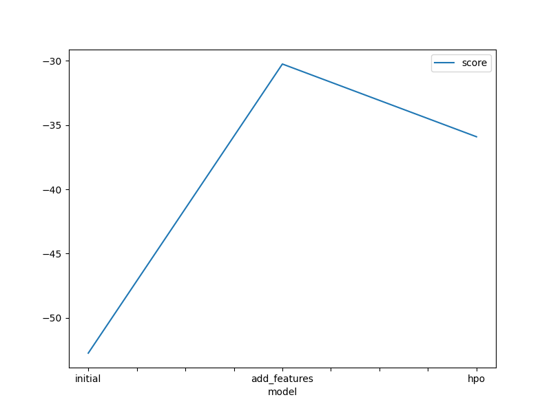
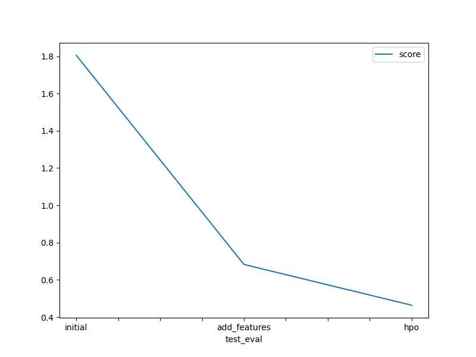

# Report: Predict Bike Sharing Demand with AutoGluon Solution
#### Dyuthi Vivek

## Initial Training
### What did you realize when you tried to submit your predictions? What changes were needed to the output of the predictor to submit your results?
Kaggle does not accept negative predictions values obtained from the predictor. They must be replaced by 0.

### What was the top ranked model that performed?
The `WeightedEnsemble_L3` model performed the best with a score of -52.746282. Kaggle gave it a score of 1.80501.

## Exploratory data analysis and feature creation
### What did the exploratory analysis find and how did you add additional features?
The datetime feature was divided into year, month, day and hour. The season and weather features were transformed into the category data type.

### How much better did your model preform after adding additional features and why do you think that is?
The `WeightedEnsemble_L3` model performed the best with a score of -30.252839 (previously was -52.746282). Kaggle gave it a score of 0.68289. Splitting the datetime features helped in enhancing the performance by helping in identifying any seasonal patterns.

## Hyper parameter tuning
### How much better did your model preform after trying different hyper parameters?
The `WeightedEnsemble_L3` model performed the best with a score of -35.912151. Overall, it performed worse than the previous step with feature creation.

### If you were given more time with this dataset, where do you think you would spend more time?
Given more time, I would analyse the dataset some more and try to figure out how to enhance the hyperparameter tuning step. 

### Create a table with the models you ran, the hyperparameters modified, and the kaggle score.
|model|hpo1|hpo2|hpo3|score|
|--|--|--|--|--|
|initial|default_vals|default_vals|default_vals|1.80501|
|add_features|default_vals|default_vals|default_vals|0.68289|
|hpo|GBM: num_leaves: lower=26, upper=66|NN_TORCH: dropout_prob: 0.0, 0.5|GBM: num_boost_round: 100|0.46402|

### Create a line plot showing the top model score for the three (or more) training runs during the project.

### Create a line plot showing the top kaggle score for the three (or more) prediction submissions during the project.

## Summary
The AutoGluon AutoML framework automates machine learning tasks, this makes it easier for us to focus on EDA and achieve better results. Hyperparameter tuning did not offer better performance than the model with more features. 